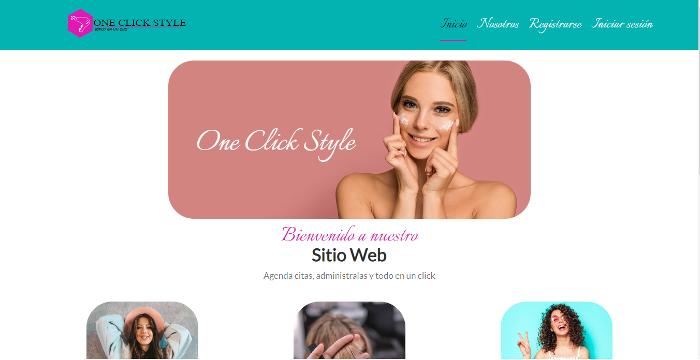

# **OCS - One Click Style** (frontend)

OCS is a web app to manage your esthetics, manage your clients, beauticians, appointments and what procedures your beauticians are able to do.

You can register with an email, Facebook account or Google account.

## 🔥 URL's

-   ✨ Project in production: https://oneclickstyle.netlify.app/
-   ✔️ Documentation: https://www.notion.so/OCS-One-Click-Style-a4aad161defc43d3a073e1900a477cd7

## 📖 Installation

`npm install`

## ⚙️ Run project

### Development environment

`npm run dev`

> Note: this project runs in **localhost:3000**

### Production

`npm run build`

## ⚔️ Technologies

-   Jest
-   Reach Router
-   ReactJS
-   StyledComponents
-   Webpack

## 🦅 Authors

-   Erick Mata / Project Manager / https://github.com/Erickowski
-   Byron Piedrahita / Backend Developer / https://github.com/ByronPiedrahita
-   Jhon Colorado / Frontend Developer / https://github.com/jcolorado19
-   Héctor Martínez / Frontend Developer / https://github.com/HectorMartinezResendiz
-   Ernesto Lázaro / UI Designer / https://github.com/ErnestoLazaro

## 💕 License

MIT
